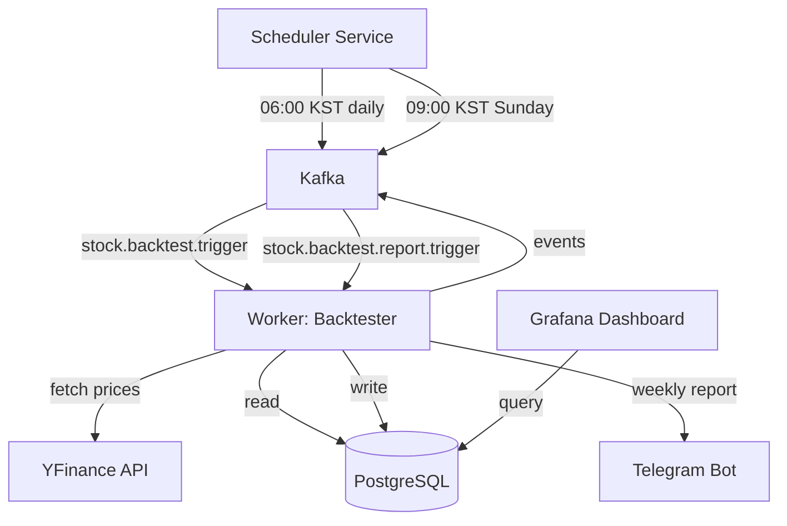

# Design Document: Backtesting System

## Overview

The backtesting system is a new independent worker service (`worker-backtester`) that validates AI recommendation performance by comparing historical recommendations against actual stock price movements. The system operates on a dual-schedule model: daily backtest calculations at 06:00 KST (before premarket data collection) and weekly performance reports on Sundays at 09:00 KST.

### Key Design Principles

1. **Non-invasive**: Read-only access to existing `recommendations` table, all backtest data stored in separate tables
2. **Resilient**: Partial failures (e.g., missing price data for some tickers) do not block overall execution
3. **Observable**: Comprehensive logging, Kafka events, and Grafana dashboards for monitoring
4. **Scalable**: Async/parallel price fetching with configurable concurrency limits

### Architecture Context

The backtesting system integrates into the existing stock-signal architecture:

- **Scheduler**: Extends `scheduler/main.py` with two new cron jobs (backtest daily, report weekly)
- **Worker**: New service `workers/backtester/` following existing worker patterns (data_collector, telegram_notifier)
- **Database**: Two new tables (`price_history`, `backtest_results`) with foreign key to `recommendations`
- **Kafka**: Three new topics for backtest lifecycle events
- **Grafana**: New dashboard for performance visualization

## Architecture

### System Components



### Data Flow

**Daily Backtest Flow (06:00 KST)**:
1. Scheduler publishes `stock.backtest.trigger` event
2. Backtester queries recommendations from past 14 days
3. Backtester fetches closing prices from YFinance (parallel, max 10 concurrent)
4. Backtester stores prices in `price_history` table (upsert)
5. Backtester calculates returns (3d, 7d, 14d) for each recommendation
6. Backtester stores results in `backtest_results` table (upsert)
7. Backtester publishes `stock.backtest.completed` event

**Weekly Report Flow (Sunday 09:00 KST)**:
1. Scheduler publishes `stock.backtest.report.trigger` event
2. Backtester queries backtest results from past 7 days
3. Backtester calculates aggregate metrics (win rate, avg return, MDD) by recommendation type
4. Backtester formats report as Telegram message
5. Backtester sends report to all active users
6. Backtester publishes `stock.backtest.report.completed` event

### Service Boundaries

- **Scheduler**: Triggers only, no business logic
- **Backtester Worker**: All price collection, calculation, and reporting logic
- **Telegram Notifier**: Not modified, backtester sends reports directly
- **Data Collector**: Not modified, continues existing macro/news/signals collection

## Components and Interfaces

### 1. Scheduler Extensions

**File**: `scheduler/main.py`

**New Functions**:
```python
async def trigger_backtest_daily() -> None:
    """KST 06:00 — 매일 백테스트 실행 트리거."""
    
async def trigger_backtest_report() -> None:
    """KST 09:00 일요일 — 주간 리포트 트리거."""
```

**New Cron Jobs**:
- `daily-backtest-trigger`: CronTrigger(hour=6, minute=0, timezone=TZ_KST)
- `weekly-report-trigger`: CronTrigger(day_of_week='sun', hour=9, minute=0, timezone=TZ_KST)

**Kafka Topics Published**:
- `stock.backtest.trigger`: `{"job_id": str, "triggered_at": str}`
- `stock.backtest.report.trigger`: `{"job_id": str, "triggered_at": str}`

### 2. Backtester Worker

**Directory Structure**:
```
workers/backtester/
├── main.py              # Entry point, Kafka consumer loop
├── processor.py         # Core backtest calculation logic
├── price_fetcher.py     # YFinance integration
├── report_generator.py  # Weekly report formatting
├── core/
│   ├── db.py           # asyncpg pool (shared pattern)
│   ├── kafka_io.py     # Kafka producer/consumer helpers
│   └── logging.py      # structlog setup
├── schemas/
│   └── events.py       # Kafka event schemas
├── Dockerfile
└── requirements.txt
```

### 3. Price Fetcher Module

**File**: `workers/backtester/price_fetcher.py`

**Key Functions**:
```python
async def fetch_prices_for_tickers(
    tickers: list[str],
    start_date: date,
    end_date: date,
    max_concurrent: int = 10
) -> dict[str, list[PriceRecord]]:
    """Fetch historical prices for multiple tickers in parallel.
    
    Returns:
        Dict mapping ticker to list of PriceRecord (date, close_price)
        Missing tickers return empty list (not KeyError)
    """

async def _fetch_one_ticker(
    ticker: str,
    start_date: date,
    end_date: date,
    retry_count: int = 3
) -> list[PriceRecord]:
    """Fetch prices for single ticker with retry logic."""
```

**YFinance Integration**:
- Reuses `yfinance` library (already in data_collector dependencies)
- Wraps synchronous yfinance calls with `asyncio.to_thread()`
- Handles rate limits with exponential backoff (60s, 120s, 240s)
- Validates close prices are positive numbers

### 4. Processor Module

**File**: `workers/backtester/processor.py`

**Key Functions**:
```python
async def run_daily_backtest(pool: asyncpg.Pool, job_id: str) -> dict:
    """Execute daily backtest calculation.
    
    Steps:
    1. Query recommendations from past 14 days
    2. Fetch prices for all unique tickers
    3. Store prices in price_history table
    4. Calculate returns for each recommendation
    5. Store results in backtest_results table
    
    Returns:
        {"recommendations_processed": int, "prices_collected": int, "errors": int}
    """

async def calculate_returns(
    pool: asyncpg.Pool,
    recommendation_id: int,
    ticker: str,
    target_trading_date: date
) -> dict[str, float | None]:
    """Calculate 3d, 7d, 14d returns for a single recommendation.
    
    Returns:
        {"return_3d": float | None, "return_7d": float | None, "return_14d": float | None}
    """
```

**Return Calculation Logic**:
```python
# Pseudocode
base_price = price_history[ticker][target_trading_date]
future_price_3d = price_history[ticker][target_trading_date + 3 trading days]

if base_price and future_price_3d:
    return_3d = ((future_price_3d - base_price) / base_price) * 100
else:
    return_3d = None
```

### 5. Report Generator Module

**File**: `workers/backtester/report_generator.py`

**Key Functions**:
```python
async def generate_weekly_report(pool: asyncpg.Pool) -> str:
    """Generate weekly performance report.
    
    Queries backtest_results joined with recommendations for past 7 days.
    Calculates metrics by recommendation_type.
    
    Returns:
        Formatted Telegram message string
    """

def format_report_message(metrics: dict) -> str:
    """Format metrics into Telegram message with table layout."""
```

**Report Format**:
```
📊 주간 백테스트 리포트 (YYYY-MM-DD ~ YYYY-MM-DD)

📈 Buy Hedge
  추천 수: 15
  승률: 66.7% (10/15)
  평균 수익률: +2.3%
  MDD: -5.1%

👀 Watch
  추천 수: 8
  승률: 50.0% (4/8)
  평균 수익률: +0.8%
  MDD: -3.2%

⚠️ Exit Alert
  추천 수: 3
  승률: 33.3% (1/3)
  평균 수익률: -1.5%
  MDD: -4.8%

전체 MDD: -5.1%
```

### 6. Kafka Event Schemas

**File**: `workers/backtester/schemas/events.py`

```python
from dataclasses import dataclass
from datetime import datetime

@dataclass
class BacktestTriggerEvent:
    job_id: str
    triggered_at: str

@dataclass
class BacktestCompletedEvent:
    job_id: str
    recommendations_processed: int
    prices_collected: int
    errors: int
    completed_at: str

@dataclass
class BacktestFailedEvent:
    job_id: str
    error_code: str
    error_message: str
    failed_at: str

@dataclass
class BacktestReportCompletedEvent:
    job_id: str
    recipient_count: int
    completed_at: str
```

## Data Models

### Database Schema

#### 1. price_history Table

```sql
CREATE TABLE IF NOT EXISTS price_history (
    id              BIGSERIAL PRIMARY KEY,
    ticker          VARCHAR(10)  NOT NULL,
    date            DATE         NOT NULL,
    close_price     NUMERIC(12,2) NOT NULL CHECK (close_price > 0),
    collected_at    TIMESTAMPTZ  NOT NULL DEFAULT NOW(),
    UNIQUE(ticker, date)
);

CREATE INDEX idx_price_history_ticker_date ON price_history(ticker, date);
```

**Design Rationale**:
- `UNIQUE(ticker, date)`: Prevents duplicate price entries, enables upsert with `ON CONFLICT DO NOTHING`
- `CHECK (close_price > 0)`: Data validation at database level
- Index on `(ticker, date)`: Optimizes lookups during return calculation

#### 2. backtest_results Table

```sql
CREATE TABLE IF NOT EXISTS backtest_results (
    id                          BIGSERIAL PRIMARY KEY,
    recommendation_id           BIGINT NOT NULL REFERENCES recommendations(id) ON DELETE CASCADE,
    recommendation_close_price  NUMERIC(12,2),
    return_3d                   NUMERIC(8,2),
    return_7d                   NUMERIC(8,2),
    return_14d                  NUMERIC(8,2),
    calculated_at               TIMESTAMPTZ NOT NULL DEFAULT NOW(),
    UNIQUE(recommendation_id)
);

CREATE INDEX idx_backtest_results_recommendation_id ON backtest_results(recommendation_id);
CREATE INDEX idx_backtest_results_calculated_at ON backtest_results(calculated_at DESC);
```

**Design Rationale**:
- `UNIQUE(recommendation_id)`: One backtest result per recommendation, enables upsert with `ON CONFLICT UPDATE`
- `ON DELETE CASCADE`: If recommendation deleted, backtest result also deleted (referential integrity)
- `recommendation_close_price`: Cached for faster report generation (denormalization trade-off)
- NULL returns: Indicates future date not yet occurred or price data unavailable

#### 3. Migration File

**File**: `backend/migrations/versions/20260505_0001_add_backtesting_tables.py`

```python
"""Add price_history and backtest_results tables.

Revision ID: 20260505_0001
Revises: 20260503_0001
Create Date: 2026-05-05
"""
import sqlalchemy as sa
from alembic import op

revision = "20260505_0001"
down_revision = "20260503_0001"

def upgrade() -> None:
    # price_history table
    op.create_table(
        "price_history",
        sa.Column("id", sa.BigInteger(), primary_key=True, autoincrement=True),
        sa.Column("ticker", sa.String(10), nullable=False),
        sa.Column("date", sa.Date(), nullable=False),
        sa.Column("close_price", sa.Numeric(12, 2), nullable=False),
        sa.Column("collected_at", sa.TIMESTAMP(timezone=True), 
                  nullable=False, server_default=sa.text("NOW()")),
        sa.CheckConstraint("close_price > 0", name="price_history_close_price_positive"),
        sa.UniqueConstraint("ticker", "date", name="price_history_ticker_date_unique"),
    )
    op.create_index("idx_price_history_ticker_date", "price_history", ["ticker", "date"])
    
    # backtest_results table
    op.create_table(
        "backtest_results",
        sa.Column("id", sa.BigInteger(), primary_key=True, autoincrement=True),
        sa.Column("recommendation_id", sa.BigInteger(), nullable=False),
        sa.Column("recommendation_close_price", sa.Numeric(12, 2)),
        sa.Column("return_3d", sa.Numeric(8, 2)),
        sa.Column("return_7d", sa.Numeric(8, 2)),
        sa.Column("return_14d", sa.Numeric(8, 2)),
        sa.Column("calculated_at", sa.TIMESTAMP(timezone=True),
                  nullable=False, server_default=sa.text("NOW()")),
        sa.ForeignKeyConstraint(["recommendation_id"], ["recommendations.id"],
                                ondelete="CASCADE", name="backtest_results_recommendation_id_fkey"),
        sa.UniqueConstraint("recommendation_id", name="backtest_results_recommendation_id_unique"),
    )
    op.create_index("idx_backtest_results_recommendation_id", "backtest_results", ["recommendation_id"])
    op.create_index("idx_backtest_results_calculated_at", "backtest_results", ["calculated_at"], 
                    postgresql_using="btree", postgresql_ops={"calculated_at": "DESC"})

def downgrade() -> None:
    op.drop_index("idx_backtest_results_calculated_at", table_name="backtest_results")
    op.drop_index("idx_backtest_results_recommendation_id", table_name="backtest_results")
    op.drop_table("backtest_results")
    op.drop_index("idx_price_history_ticker_date", table_name="price_history")
    op.drop_table("price_history")
```

### Kafka Topics

#### 1. stock.backtest.trigger

**Producer**: Scheduler  
**Consumer**: Backtester Worker  
**Schema**:
```json
{
  "job_id": "uuid-string",
  "triggered_at": "2026-05-05T06:00:00Z"
}
```

#### 2. stock.backtest.completed

**Producer**: Backtester Worker  
**Consumer**: None (monitoring only)  
**Schema**:
```json
{
  "job_id": "uuid-string",
  "recommendations_processed": 42,
  "prices_collected": 35,
  "errors": 2,
  "completed_at": "2026-05-05T06:15:23Z"
}
```

#### 3. stock.backtest.failed

**Producer**: Backtester Worker  
**Consumer**: None (monitoring/alerting)  
**Schema**:
```json
{
  "job_id": "uuid-string",
  "error_code": "YFINANCE_RATE_LIMIT_EXCEEDED",
  "error_message": "Failed to fetch prices for 60% of tickers",
  "failed_at": "2026-05-05T06:10:15Z"
}
```

#### 4. stock.backtest.report.trigger

**Producer**: Scheduler  
**Consumer**: Backtester Worker  
**Schema**:
```json
{
  "job_id": "uuid-string",
  "triggered_at": "2026-05-05T09:00:00Z"
}
```

#### 5. stock.backtest.report.completed

**Producer**: Backtester Worker  
**Consumer**: None (monitoring only)  
**Schema**:
```json
{
  "job_id": "uuid-string",
  "recipient_count": 5,
  "completed_at": "2026-05-05T09:02:45Z"
}
```

### Grafana Dashboard

**File**: `infra/grafana/dashboards/backtesting-performance.json`

**Dashboard Structure**:

1. **Time Series Panel: Daily Win Rate by Type**
   - Query: 
   ```sql
   SELECT 
     r.target_trading_date as time,
     r.recommendation_type,
     COUNT(CASE WHEN br.return_3d > 0 THEN 1 END)::float / 
       NULLIF(COUNT(br.return_3d), 0) * 100 as win_rate
   FROM backtest_results br
   JOIN recommendations r ON br.recommendation_id = r.id
   WHERE br.return_3d IS NOT NULL
     AND $__timeFilter(r.target_trading_date)
   GROUP BY r.target_trading_date, r.recommendation_type
   ORDER BY time
   ```

2. **Bar Chart Panel: Average Return by Type (30 days)**
   - Query:
   ```sql
   SELECT 
     r.recommendation_type,
     AVG(br.return_3d) as avg_return
   FROM backtest_results br
   JOIN recommendations r ON br.recommendation_id = r.id
   WHERE br.return_3d IS NOT NULL
     AND r.target_trading_date >= CURRENT_DATE - INTERVAL '30 days'
   GROUP BY r.recommendation_type
   ```

3. **Line Chart Panel: Cumulative Return**
   - Query:
   ```sql
   SELECT 
     r.target_trading_date as time,
     SUM(br.return_3d) OVER (ORDER BY r.target_trading_date) as cumulative_return
   FROM backtest_results br
   JOIN recommendations r ON br.recommendation_id = r.id
   WHERE br.return_3d IS NOT NULL
     AND $__timeFilter(r.target_trading_date)
   ORDER BY time
   ```

4. **Stat Panel: Overall Win Rate**
   - Query:
   ```sql
   SELECT 
     COUNT(CASE WHEN return_3d > 0 THEN 1 END)::float / 
       NULLIF(COUNT(return_3d), 0) * 100 as win_rate
   FROM backtest_results
   WHERE return_3d IS NOT NULL
   ```

5. **Stat Panel: Total Backtested Recommendations**
   - Query:
   ```sql
   SELECT COUNT(*) as total
   FROM backtest_results
   WHERE return_3d IS NOT NULL
   ```

6. **Table Panel: Recent Recommendations with Returns**
   - Query:
   ```sql
   SELECT 
     r.target_trading_date,
     r.ticker,
     r.recommendation_type,
     br.recommendation_close_price,
     br.return_3d,
     br.return_7d,
     br.return_14d
   FROM backtest_results br
   JOIN recommendations r ON br.recommendation_id = r.id
   ORDER BY r.target_trading_date DESC
   LIMIT 50
   ```

**Dashboard Variables**:
- `$recommendation_type`: Multi-select dropdown (buy_hedge, watch, exit_alert, All)
- `$__timeFilter`: Grafana built-in time range filter


## Correctness Properties

*A property is a characteristic or behavior that should hold true across all valid executions of a system—essentially, a formal statement about what the system should do. Properties serve as the bridge between human-readable specifications and machine-verifiable correctness guarantees.*

### Property 1: Return Calculation Correctness

*For any* recommendation with a valid base price and future price, the calculated return SHALL equal `((future_price - base_price) / base_price) * 100` for each period (3d, 7d, 14d).

**Validates: Requirements 2.3**

### Property 2: YFinance Data Round-Trip

*For any* valid price data fetched from YFinance, parsing the response then formatting it back SHALL produce equivalent data (date and close_price values preserved).

**Validates: Requirements 7.8, 7.1, 7.2, 7.3**

### Property 3: Recommendations Table Immutability

*For any* backtest execution, the recommendations table SHALL remain unchanged (no inserts, updates, or deletes).

**Validates: Requirements 2.8**

### Property 4: Job Lifecycle Management

*For any* backtest execution, a job record SHALL be created with job_type "backtest_daily" and its status SHALL transition to either "completed" or "failed" upon execution completion.

**Validates: Requirements 3.6, 3.7**

### Property 5: Event Publishing Completeness

*For any* backtest execution, the system SHALL publish exactly one lifecycle event: either "stock.backtest.completed" (on success) or "stock.backtest.failed" (on failure), and for any successful weekly report generation, SHALL publish "stock.backtest.report.completed".

**Validates: Requirements 3.3, 3.4, 4.9**

### Property 6: Report Date Range Accuracy

*For any* weekly report generation, the included recommendations SHALL have target_trading_date within the past 7 days from the report generation date.

**Validates: Requirements 4.2**

### Property 7: Report Metrics Correctness

*For any* set of backtest results grouped by recommendation_type, the calculated win_rate SHALL equal `(count of return_3d > 0) / (count of non-NULL return_3d) * 100`, the average return SHALL equal the mean of all non-NULL return_3d values, and MDD SHALL equal the maximum negative return value.

**Validates: Requirements 4.3, 4.4, 4.5**

### Property 8: Report Format Completeness

*For any* weekly report metrics, the formatted Telegram message SHALL contain all required fields: recommendation_type, count, win_rate, avg_return, and MDD for each type.

**Validates: Requirements 4.6**

### Property 9: Report Distribution Completeness

*For any* weekly report generation, the report SHALL be sent to all users with status='active' in the users table.

**Validates: Requirements 4.7**

### Property 10: Error Recording Consistency

*For any* error that occurs during backtest execution, an error record SHALL be created in the job_errors table with service="backtesting".

**Validates: Requirements 6.4**

### Property 11: Backtest Result Update Preservation

*For any* recommendation with existing backtest results, recalculation SHALL only update return values that are currently NULL, preserving all non-NULL values.

**Validates: Requirements 9.3**

### Property 12: Trading Day Calculation Accuracy

*For any* target_trading_date, the date used for return_3d calculation SHALL be exactly 3 trading days (excluding weekends and Korean holidays) after the target_trading_date.

**Validates: Requirements 9.5**

### Property 13: Structured Logging Completeness

*For any* major operation (backtest start, price collection completion, return calculation completion, report generation), a structured log event SHALL be emitted with the operation name and relevant context (counts, timestamps).

**Validates: Requirements 10.2, 10.3, 10.4, 10.5**

### Property 14: Job Progress Tracking

*For any* backtest job execution, the progress field SHALL be updated incrementally through the values [0, 25, 50, 75, 100] as execution proceeds.

**Validates: Requirements 10.7**

### Property 15: Ticker Query Completeness

*For any* backtest trigger, the system SHALL query all unique tickers from recommendations with target_trading_date within the past 14 days.

**Validates: Requirements 1.2**

### Property 16: Price Fetch Date Range Accuracy

*For any* ticker being processed, the YFinance fetch SHALL request prices for the date range from the earliest target_trading_date to the current date.

**Validates: Requirements 1.3**

### Property 17: Base Price Retrieval Accuracy

*For any* recommendation being processed, the system SHALL retrieve the close_price from price_history where ticker matches and date equals target_trading_date.

**Validates: Requirements 2.2**

## Error Handling

### Error Categories

1. **External Service Failures**
   - YFinance API unavailable or rate-limited
   - Telegram API failures
   - Kafka broker unavailable

2. **Data Quality Issues**
   - Missing price data for specific dates
   - Delisted stocks returning empty data
   - Invalid price values (NULL, negative, zero)

3. **Database Errors**
   - Connection pool exhaustion
   - Transaction deadlocks
   - Constraint violations

4. **Business Logic Errors**
   - No recommendations in past 14 days
   - All returns are NULL (insufficient data)
   - More than 50% of tickers fail to fetch

### Error Handling Strategies

#### 1. Retry with Exponential Backoff

**Applies to**: YFinance rate limits, transient network errors

```python
async def fetch_with_retry(ticker: str, max_retries: int = 3) -> list[PriceRecord]:
    for attempt in range(max_retries):
        try:
            return await _fetch_one_ticker(ticker)
        except RateLimitError as e:
            if attempt < max_retries - 1:
                wait_time = 60 * (2 ** attempt)  # 60s, 120s, 240s
                logger.warning("rate_limit_retry", ticker=ticker, wait_time=wait_time)
                await asyncio.sleep(wait_time)
            else:
                raise
```

#### 2. Graceful Degradation

**Applies to**: Individual ticker failures, missing price data

- Continue processing remaining tickers if one fails
- Store NULL for return periods when future price unavailable
- Log warnings but don't fail entire job

```python
async def process_tickers(tickers: list[str]) -> dict[str, list[PriceRecord]]:
    results = {}
    for ticker in tickers:
        try:
            results[ticker] = await fetch_with_retry(ticker)
        except Exception as e:
            logger.warning("ticker_fetch_failed", ticker=ticker, error=str(e))
            results[ticker] = []  # Empty list, not KeyError
    return results
```

#### 3. Transaction Rollback

**Applies to**: Database errors during batch operations

```python
async def store_prices_batch(pool: asyncpg.Pool, prices: list[PriceRecord]) -> None:
    async with pool.acquire() as conn:
        async with conn.transaction():
            try:
                await conn.executemany(
                    "INSERT INTO price_history (ticker, date, close_price) "
                    "VALUES ($1, $2, $3) ON CONFLICT DO NOTHING",
                    [(p.ticker, p.date, p.close_price) for p in prices]
                )
            except Exception as e:
                logger.error("batch_insert_failed", error=str(e))
                # Transaction automatically rolled back
                raise
```

#### 4. Circuit Breaker

**Applies to**: Catastrophic failures (>50% ticker failures)

```python
async def run_daily_backtest(pool: asyncpg.Pool, job_id: str) -> dict:
    total_tickers = len(tickers)
    successful_tickers = len([r for r in results.values() if r])
    failure_rate = (total_tickers - successful_tickers) / total_tickers
    
    if failure_rate > 0.5:
        logger.error("backtest_circuit_breaker_triggered", failure_rate=failure_rate)
        await update_job_status(pool, job_id, "failed")
        await publish_event("stock.backtest.failed", {
            "job_id": job_id,
            "error_code": "HIGH_FAILURE_RATE",
            "error_message": f"{failure_rate*100:.1f}% of tickers failed"
        })
        raise CircuitBreakerError("Too many ticker failures")
```

#### 5. Error Recording

**Applies to**: All errors

```python
async def record_error(pool: asyncpg.Pool, job_id: str, error: Exception) -> None:
    await pool.execute(
        "INSERT INTO job_errors (job_id, service, error_code, message, traceback) "
        "VALUES ($1, $2, $3, $4, $5)",
        job_id,
        "backtesting",
        type(error).__name__,
        str(error),
        traceback.format_exc()
    )
```

### Error Recovery Procedures

1. **YFinance Rate Limit Exceeded**
   - Automatic: Wait and retry with exponential backoff
   - Manual: If persistent, check YFinance service status

2. **Database Connection Pool Exhausted**
   - Automatic: Requests queue until connection available
   - Manual: Increase pool size in configuration if persistent

3. **Missing Price Data**
   - Automatic: Store NULL for affected return periods
   - Manual: Investigate if specific ticker consistently missing

4. **Telegram Send Failure**
   - Automatic: Retry up to 3 times
   - Manual: Check bot token and user chat_id validity

5. **High Failure Rate (>50%)**
   - Automatic: Mark job as failed, send alert
   - Manual: Investigate YFinance service health, check network connectivity

## Testing Strategy

### Dual Testing Approach

The backtesting system requires both unit tests and property-based tests for comprehensive coverage:

- **Unit tests**: Verify specific examples, edge cases, and error conditions
- **Property tests**: Verify universal properties across all inputs
- Both are complementary and necessary

### Unit Testing

**Focus Areas**:
1. **Specific Examples**: Known input/output pairs for return calculations
2. **Edge Cases**: Empty DataFrames, NULL prices, delisted stocks, non-trading days
3. **Error Conditions**: Rate limits, database errors, missing data
4. **Integration Points**: Database transactions, Kafka event publishing, Telegram sending

**Example Unit Tests**:

```python
# test_return_calculation.py
def test_return_calculation_known_values():
    """Test return calculation with known input/output."""
    base_price = 100.0
    future_price = 105.0
    expected_return = 5.0
    
    result = calculate_return(base_price, future_price)
    
    assert result == expected_return

def test_return_calculation_negative():
    """Test return calculation with loss."""
    base_price = 100.0
    future_price = 95.0
    expected_return = -5.0
    
    result = calculate_return(base_price, future_price)
    
    assert result == expected_return

def test_missing_future_price_returns_null():
    """Test that missing future price results in NULL return."""
    recommendation = create_recommendation(ticker="AAPL")
    # No price data for future date
    
    result = calculate_returns(pool, recommendation.id, "AAPL", date(2026, 5, 5))
    
    assert result["return_3d"] is None
```

**Edge Case Tests**:

```python
def test_empty_yfinance_response():
    """Test handling of empty DataFrame from YFinance."""
    empty_df = pd.DataFrame()
    
    result = parse_yfinance_response(empty_df)
    
    assert result == []
    # Should not raise exception

def test_delisted_stock_handling():
    """Test that delisted stocks are skipped gracefully."""
    with patch('yfinance.Ticker') as mock_ticker:
        mock_ticker.return_value.history.return_value = pd.DataFrame()
        
        result = await fetch_prices_for_tickers(["DELISTED"], date(2026, 1, 1), date(2026, 5, 5))
        
        assert result["DELISTED"] == []
        # Should not raise exception

def test_non_trading_day_uses_next_available():
    """Test that non-trading days use next available trading day."""
    target_date = date(2026, 5, 3)  # Saturday
    # Price history has data for 2026-05-05 (Monday)
    
    result = calculate_returns(pool, rec_id, "AAPL", target_date)
    
    # Should use Monday's price, not fail
    assert result["return_3d"] is not None
```

### Property-Based Testing

**Library**: Use `hypothesis` for Python property-based testing

**Configuration**: Minimum 100 iterations per property test

**Tagging Format**: Each test must reference its design property:
```python
# Feature: backtesting-system, Property 1: Return Calculation Correctness
```

**Property Test Examples**:

```python
from hypothesis import given, strategies as st

# Feature: backtesting-system, Property 1: Return Calculation Correctness
@given(
    base_price=st.floats(min_value=0.01, max_value=10000.0),
    future_price=st.floats(min_value=0.01, max_value=10000.0)
)
@settings(max_examples=100)
def test_return_calculation_formula(base_price: float, future_price: float):
    """For any valid prices, return calculation follows the formula."""
    expected = ((future_price - base_price) / base_price) * 100
    
    result = calculate_return(base_price, future_price)
    
    assert abs(result - expected) < 0.01  # Allow floating point tolerance

# Feature: backtesting-system, Property 2: YFinance Data Round-Trip
@given(
    prices=st.lists(
        st.tuples(
            st.dates(min_value=date(2020, 1, 1), max_value=date(2026, 12, 31)),
            st.floats(min_value=0.01, max_value=10000.0)
        ),
        min_size=1,
        max_size=100
    )
)
@settings(max_examples=100)
def test_yfinance_parse_format_roundtrip(prices: list[tuple[date, float]]):
    """For any price data, parsing then formatting preserves values."""
    # Create mock YFinance DataFrame
    df = create_mock_yfinance_df(prices)
    
    # Parse
    parsed = parse_yfinance_response(df)
    
    # Format back
    formatted = format_to_yfinance_df(parsed)
    
    # Verify round-trip
    for (original_date, original_price), parsed_record in zip(prices, parsed):
        assert parsed_record.date == original_date
        assert abs(parsed_record.close_price - original_price) < 0.01

# Feature: backtesting-system, Property 3: Recommendations Table Immutability
@given(
    recommendations=st.lists(
        st.builds(Recommendation),
        min_size=1,
        max_size=50
    )
)
@settings(max_examples=100)
async def test_recommendations_table_unchanged(recommendations: list[Recommendation]):
    """For any backtest execution, recommendations table remains unchanged."""
    # Store initial state
    initial_count = await pool.fetchval("SELECT COUNT(*) FROM recommendations")
    initial_checksums = await pool.fetch(
        "SELECT id, md5(ROW(*)::text) as checksum FROM recommendations"
    )
    
    # Run backtest
    await run_daily_backtest(pool, str(uuid.uuid4()))
    
    # Verify unchanged
    final_count = await pool.fetchval("SELECT COUNT(*) FROM recommendations")
    final_checksums = await pool.fetch(
        "SELECT id, md5(ROW(*)::text) as checksum FROM recommendations"
    )
    
    assert initial_count == final_count
    assert initial_checksums == final_checksums

# Feature: backtesting-system, Property 7: Report Metrics Correctness
@given(
    returns=st.lists(
        st.floats(min_value=-100.0, max_value=100.0) | st.none(),
        min_size=1,
        max_size=100
    )
)
@settings(max_examples=100)
def test_report_metrics_calculation(returns: list[float | None]):
    """For any set of returns, metrics are calculated correctly."""
    non_null_returns = [r for r in returns if r is not None]
    
    if not non_null_returns:
        # Skip if all NULL
        return
    
    metrics = calculate_report_metrics(returns)
    
    # Verify win rate
    wins = len([r for r in non_null_returns if r > 0])
    expected_win_rate = (wins / len(non_null_returns)) * 100
    assert abs(metrics["win_rate"] - expected_win_rate) < 0.01
    
    # Verify average return
    expected_avg = sum(non_null_returns) / len(non_null_returns)
    assert abs(metrics["avg_return"] - expected_avg) < 0.01
    
    # Verify MDD
    expected_mdd = min(non_null_returns)
    assert abs(metrics["mdd"] - expected_mdd) < 0.01

# Feature: backtesting-system, Property 12: Trading Day Calculation Accuracy
@given(
    target_date=st.dates(min_value=date(2020, 1, 1), max_value=date(2026, 12, 31))
)
@settings(max_examples=100)
def test_trading_day_calculation(target_date: date):
    """For any target date, 3d calculation skips non-trading days."""
    calculated_date = calculate_future_trading_date(target_date, days=3)
    
    # Count trading days between
    trading_days = count_trading_days_between(target_date, calculated_date)
    
    assert trading_days == 3
    assert is_trading_day(calculated_date)
```

### Integration Testing

**Focus**: End-to-end flows with real database and mocked external services

```python
@pytest.mark.integration
async def test_full_backtest_flow():
    """Test complete backtest flow from trigger to completion."""
    # Setup: Create recommendations in database
    recommendations = await create_test_recommendations(pool, count=10)
    
    # Mock YFinance responses
    with patch('yfinance.Ticker') as mock_ticker:
        mock_ticker.return_value.history.return_value = create_mock_price_data()
        
        # Trigger backtest
        job_id = str(uuid.uuid4())
        result = await run_daily_backtest(pool, job_id)
        
        # Verify results stored
        backtest_results = await pool.fetch(
            "SELECT * FROM backtest_results WHERE recommendation_id = ANY($1)",
            [r.id for r in recommendations]
        )
        
        assert len(backtest_results) == 10
        assert all(r["return_3d"] is not None for r in backtest_results)
        
        # Verify job completed
        job = await pool.fetchrow("SELECT * FROM jobs WHERE id = $1", job_id)
        assert job["status"] == "completed"

@pytest.mark.integration
async def test_weekly_report_generation():
    """Test weekly report generation and Telegram sending."""
    # Setup: Create backtest results
    await create_test_backtest_results(pool, count=20)
    
    # Mock Telegram bot
    with patch('telegram.Bot.send_message') as mock_send:
        job_id = str(uuid.uuid4())
        result = await generate_and_send_weekly_report(pool, bot, job_id)
        
        # Verify report sent to all active users
        active_users = await pool.fetch("SELECT chat_id FROM users WHERE status = 'active'")
        assert mock_send.call_count == len(active_users)
        
        # Verify report content
        sent_message = mock_send.call_args[1]["text"]
        assert "주간 백테스트 리포트" in sent_message
        assert "Buy Hedge" in sent_message
        assert "승률" in sent_message
```

### Test Coverage Goals

- **Unit Tests**: 80%+ line coverage
- **Property Tests**: All 17 correctness properties implemented
- **Integration Tests**: All major flows (daily backtest, weekly report)
- **Edge Cases**: All error conditions from Requirements 6, 7, 9

### Continuous Integration

- Run unit tests on every commit
- Run property tests (100 iterations) on every PR
- Run integration tests before merge to main
- Generate coverage reports and fail if below threshold
