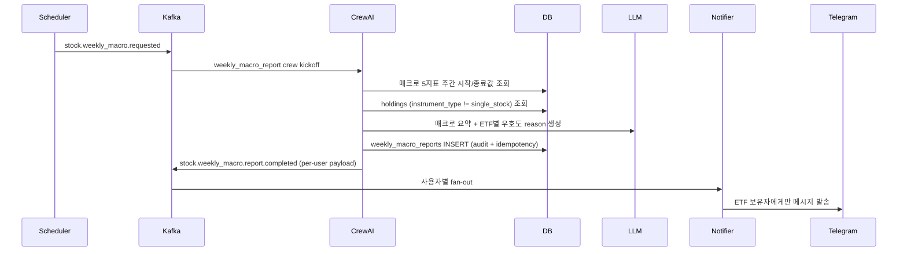

# Design Document: ETF Policy & Weekly Macro Report

## Overview

ETF/ETN 등 지수형 자산을 단일주와 분리하여 평가하는 정책 변경 + 주 1회 매크로 요약 + ETF 우호도 리포트 추가 설계.

핵심 설계 원칙:
- **최소 변경**: 새 worker 만들지 않고 기존 crewai에 weekly cycle만 추가 (별도 crew/task)
- **데이터 중심**: `holdings.instrument_type` 컬럼이 단일 진실 공급원
- **자동 + 수동 보정**: 등록 시 자동 감지 + 수동 ALTER 가능
- **하위 호환**: 기존 single_stock 흐름 무손상

## Architecture

### 컴포넌트 변경 요약

```
[기존 일일 사이클]
scheduler --(stock.data.requested)--> data_collector
data_collector --(stock.data.completed)--> crewai (stock_recommendation crew)
crewai --(stock.recommendations.completed)--> notifier

[변경: 일일 사이클 — ETF 제외만]
crewai의 HoldingsQueryTool이 instrument_type='single_stock' 필터
notifier의 fan-out 시 ETF 보유는 daily 추천에서 매칭 제외

[추가: 주간 사이클]
scheduler --(stock.weekly_macro.requested, 매주 월 07:00 KST)--> crewai
crewai (새 crew: weekly_macro_report) --(stock.weekly_macro.report.completed)--> notifier
notifier가 ETF 보유 사용자에게만 fan-out
```

### Sequence (주간 사이클)



## Components and Interfaces

### 1. Database Schema 확장

**holdings 테이블에 컬럼 추가**:

```sql
ALTER TABLE holdings ADD COLUMN instrument_type VARCHAR(20) NOT NULL DEFAULT 'single_stock';
-- 허용값: 'single_stock' | 'index_etf' | 'sector_etf'
CREATE INDEX idx_holdings_instrument_type ON holdings(instrument_type)
    WHERE instrument_type != 'single_stock';
```

**Alembic 마이그레이션** (`20260514_0001_add_instrument_type.py`):
- upgrade: 컬럼 추가 + 기존 row 백필 (Python 매처로 name 분석)
- downgrade: 컬럼 drop

**audit 테이블 신규** (`weekly_macro_reports`):

```sql
CREATE TABLE weekly_macro_reports (
    id BIGSERIAL PRIMARY KEY,
    week_start DATE NOT NULL,
    week_end DATE NOT NULL,
    job_id UUID,
    macro_summary TEXT,           -- LLM 매크로 요약
    macro_values JSONB,            -- {us10y: {start, end, delta_pct}, ...}
    etf_evaluations JSONB,         -- [{ticker, name, verdict, reason}, ...] — per-user 매핑은 fan-out 시
    generated_at TIMESTAMPTZ NOT NULL DEFAULT NOW(),
    UNIQUE(week_start)
);
```

### 2. Instrument Type Inference

**Module**: `shared/utils/instrument_type.py` (신규)

```python
import re
from typing import Final

_ETF_BRAND_PATTERNS: Final = (
    "KODEX", "TIGER", "KBSTAR", "ARIRANG", "KOSEF",
    "HANARO", "ETN", "ACE", "RISE",
)

_INDEX_KEYWORDS: Final = (
    "S&P", "KOSPI", "KOSDAQ", "NASDAQ", "DOW", "CSI", "MSCI", "지수",
)


def infer_instrument_type(name: str | None) -> str:
    """종목명에서 instrument_type 추정 — 순수 함수 (DB 의존 없음).

    Returns: 'single_stock' | 'index_etf' | 'sector_etf'

    분류 규칙:
    - 이름이 비었거나 None → 'single_stock' (보수적 기본값)
    - ETF 브랜드 prefix(KODEX/TIGER 등) 포함 AND 지수 키워드 포함 → 'index_etf'
    - ETF 브랜드만 포함 → 'sector_etf'
    - 그 외 → 'single_stock'

    예시:
    - "삼성 KODEX 미국S&P500 증권상장지수투자신탁[주식]" → 'index_etf'
    - "TIGER 2차전지테마" → 'sector_etf'
    - "삼성전자보통주" → 'single_stock'
    """
    if not name:
        return "single_stock"
    upper = name.upper()
    has_brand = any(pat in upper for pat in _ETF_BRAND_PATTERNS)
    if not has_brand:
        return "single_stock"
    has_index = any(kw.upper() in upper for kw in _INDEX_KEYWORDS)
    return "index_etf" if has_index else "sector_etf"
```

**호출 지점**:
- `backend/routers/holdings.py` `/add` 핸들러 — 등록 시 name 받으면 infer 결과로 컬럼 채움
- `workers/data_collector/processor.py` `_fill_holding_names` — name이 KIS로 채워질 때 재평가 (현재 single_stock 행 한정)

### 3. CrewAI 일일 사이클 변경

**[crewai/crews/stock_recommendation/tools.py](crewai/crews/stock_recommendation/tools.py)** — `HoldingsQueryTool`:

```python
class HoldingsQueryTool(VibeBaseTool):
    name = "holdings_query"
    description = (
        "단일주(single_stock) 보유 종목 합집합 조회. ETF/ETN 등 지수형 자산은 별도 주간 "
        "매크로 리포트로 평가하므로 일일 추천 풀에서 제외된다."
    )
    args_schema = HoldingsQueryInput

    def _run(self) -> str:
        try:
            with get_pool().connection() as conn, conn.cursor() as cur:
                cur.execute(
                    "SELECT ticker, name FROM holdings "
                    "WHERE instrument_type = 'single_stock' ORDER BY ticker"
                )
                rows = [{"ticker": r[0], "name": r[1]} for r in cur.fetchall()]
            return self.ok(json.dumps({"count": len(rows), "tickers": [r["ticker"] for r in rows]}))
        except Exception as exc:
            return self.err_unknown(str(exc))
```

**[workers/telegram_notifier](workers/telegram_notifier/)** — 추가 방어:
- daily 추천 fan-out 시, 사용자별 holdings 매칭에서 `instrument_type != 'single_stock'` 행은 제외 (이미 crewai가 걸렀지만 이중 안전망).

### 4. 새 Crew: WeeklyMacroReportCrew

**경로**: `crewai/crews/weekly_macro/`

```
weekly_macro/
├── __init__.py
├── crew.py        # WeeklyMacroReportCrew (Sequential 2-task)
├── agents.py      # MacroSummarizer + ETFEvaluator
├── tasks.py       # MacroSummaryTask + ETFEvaluationTask
└── tools.py       # MacroWeeklyQueryTool, ETFHoldingsQueryTool
```

**Agents**:

```python
class MacroSummarizerAgent(BaseAgent):
    role = "주간 매크로 요약가"
    goal = "이번 주 매크로 5지표 변화를 한국어 한 문단(3~5줄)으로 요약. 환경 톤(우호/혼조/비우호) 명시."
    backstory = (
        "10년 매크로 분석가. 지표 절대값보다 **추세와 상호작용**(달러-금리, 원자재-인플레이션 등)에 "
        "초점. 한국 시장의 다음 주 흐름에 가장 큰 영향을 주는 1~2개 요인을 강조한다."
    )
    tools = (MacroWeeklyQueryTool(),)


class ETFEvaluatorAgent(BaseAgent):
    role = "ETF 우호도 판정가"
    goal = (
        "ETF 보유 종목 각각에 대해 추종 지수와 매크로 환경의 일치 여부를 평가하여 "
        "favorable / caution / unfavorable 판정 + 한국어 한 줄 사유 생성."
    )
    backstory = (
        "ETF 전문가. 추종 지수의 매크로 우호도와 환차익/환차손, 섹터 모멘텀 등을 "
        "종합적으로 평가한다. 미매핑 ETF는 일반 매크로 톤을 적용하며 그 사실을 명시한다."
    )
    tools = (ETFHoldingsQueryTool(),)
```

**Tasks**:

```python
class MacroSummaryTask(BaseTask):
    description = (
        "이번 주(보고 시점 {week_start}~{week_end})의 매크로 5지표를 조회하고 "
        "한국어 3~5줄 요약을 작성하라.\n"
        "macro_weekly_query Tool을 1회 호출하여 시작/종료값과 변화율을 받는다.\n"
        "출력 JSON: {summary: '...', tone: 'favorable'|'mixed'|'unfavorable', "
        "key_drivers: ['요인1', '요인2']}"
    )
    expected_output = "JSON 형식 매크로 주간 요약. 한국어."


class ETFEvaluationTask(BaseTask):
    description = (
        "etf_holdings_query Tool로 ETF 종목 합집합 조회 → 각 ETF에 대해 "
        "추종 지수와 이번 주 매크로 톤을 비교하여 favorable/caution/unfavorable 판정.\n"
        "추종 지수 매핑은 Tool 결과의 tracking_index 필드 참조 (없으면 'unknown', 일반 톤 적용).\n"
        "출력 JSON 배열: [{ticker, name, verdict, reason: '한국어 한 줄'}, ...]"
    )
    expected_output = "JSON 배열. 종목별 verdict + 한국어 사유."
```

**Crew on_complete**: 결과를 `weekly_macro_reports` INSERT + per-user payload 만들어 Kafka publish.

### 5. Tracking Index 매핑

**Module**: `crewai/crews/weekly_macro/etf_mapping.py`

```python
# 알려진 한국 ETF의 추종 지수 매핑.
# 신규 ETF 등록 시 이 파일에 추가하거나 향후 DB 테이블로 분리 가능.
TICKER_TO_INDEX: dict[str, str] = {
    "379800": "sp500",     # KODEX 미국S&P500
    "069500": "kospi",     # KODEX 200
    "229200": "kosdaq",    # KODEX 코스닥150
    "133690": "nasdaq",    # TIGER 미국나스닥100
    "360200": "sp500",     # ACE 미국S&P500
    # ... 점진 추가
}


def tracking_index(ticker: str) -> str | None:
    return TICKER_TO_INDEX.get(ticker)
```

### 6. Scheduler 확장

**[scheduler/main.py](scheduler/main.py)** — 새 cron 추가:

```python
async def trigger_weekly_macro() -> None:
    """매주 월요일 07:00 KST. 월이 휴장일이면 다음 거래일로 시프트."""
    today_kst = datetime.now(TZ_KST).date()
    target = today_kst
    while not is_market_open(target):
        target += timedelta(days=1)
        if (target - today_kst).days > 5:
            logger.warning("weekly_macro_skip_no_trading_day_in_week", today=today_kst.isoformat())
            return
    job_id = str(uuid.uuid4())
    await _publish_to(TOPIC_WEEKLY_MACRO, {
        "job_id": job_id,
        "mode": "weekly_macro",
        "target_date": target.isoformat(),
        "triggered_at": datetime.utcnow().isoformat(),
    })


scheduler.add_job(
    trigger_weekly_macro,
    CronTrigger(day_of_week="mon", hour=7, minute=0, timezone=TZ_KST),
    id="weekly-macro-trigger",
)
```

`TOPIC_WEEKLY_MACRO = "stock.weekly_macro.requested"` 신규 토픽.

### 7. CrewAI main.py 라우팅

기존 stock_recommendation crew와 weekly_macro_report crew를 같은 worker에서 모두 처리. Kafka 토픽으로 분기:

```python
TOPICS_IN = ["stock.data.completed", "stock.weekly_macro.requested"]

# 메시지 받으면 mode 또는 topic으로 어떤 crew 실행할지 결정
if event_topic == "stock.weekly_macro.requested":
    crew = WeeklyMacroReportCrew(job_id=job_id)
else:
    crew = StockRecommendationCrew(job_id=job_id)
```

### 8. Notifier 분기

새 토픽 `stock.weekly_macro.report.completed` 컨슈머 추가. 메시지 포맷:

```json
{
  "job_id": "...",
  "week_start": "2026-05-11",
  "week_end": "2026-05-15",
  "macro": {
    "summary": "...",
    "indicators": [{"name": "us10y", "start": 4.50, "end": 4.42, "delta_pct": -1.8}, ...]
  },
  "per_user_etfs": {
    "<chat_id>": [
      {"ticker": "379800", "name": "KODEX 미국S&P500", "verdict": "favorable", "reason": "..."},
      ...
    ]
  }
}
```

notifier가 per_user_etfs 키를 iterate하며 각 사용자에게 fan-out. ETF 없는 사용자는 키 없음 → 메시지 안 감.

## Data Models

### Holding (Extended)

```python
class Holding(BaseModel):
    user_id: int
    ticker: str
    name: Optional[str] = None
    avg_price: Optional[Decimal] = None
    instrument_type: Literal["single_stock", "index_etf", "sector_etf"] = "single_stock"  # NEW
```

### WeeklyMacroReport

```python
@dataclass
class MacroWeekValue:
    name: str  # "us10y" | "dxy" | ...
    start: Optional[float]
    end: Optional[float]
    delta_abs: Optional[float]
    delta_pct: Optional[float]


@dataclass
class ETFEvaluation:
    ticker: str
    name: str
    tracking_index: Optional[str]
    verdict: Literal["favorable", "caution", "unfavorable"]
    reason: str  # 한국어 한 줄


@dataclass
class WeeklyMacroReport:
    week_start: date
    week_end: date
    indicators: list[MacroWeekValue]
    summary: str
    tone: Literal["favorable", "mixed", "unfavorable"]
    etf_evaluations: list[ETFEvaluation]
```

## Correctness Properties

- **P1**: `infer_instrument_type` is deterministic — same input always yields same output.
- **P2**: Daily cycle never produces an `exit_alert` row for `instrument_type != 'single_stock'` (HoldingsQueryTool filter + notifier defense).
- **P3**: Weekly_Macro_Report is **skipped silently** for users without ETF holdings (no empty messages).
- **P4**: Migration backfill correctly classifies all existing test holdings (verified by integration test).
- **P5**: Monday holiday shift preserves at-most-one trigger per week (no double-fire).

## Failure Modes & Handling

| Failure | Handling |
|---|---|
| LLM 응답 파싱 실패 (weekly) | 기본 메시지 ("이번 주 매크로 데이터 수집됨, 자세한 평가는 다음 주") 발송 + DLQ |
| 매크로 데이터 부족 | 인디케이터별 "데이터 부족" 표기, summary는 가용 데이터만으로 작성 |
| ETF tracking_index 미매핑 | verdict = 'caution' (보수적) + reason에 "추종 지수 미확인" |
| Telegram 발송 실패 | per-user try/except, 다른 사용자 발송은 계속 |

## Migration Strategy

1. Alembic upgrade: `instrument_type` 컬럼 추가 (default `'single_stock'`)
2. 동일 마이그레이션 안에서 Python으로 기존 holdings.name을 읽어 `infer_instrument_type` 호출 → UPDATE
3. 배포 후 KIS API로 name이 채워지지 않은 종목은 다음 `_fill_holding_names` 사이클에서 재평가
4. dev DB는 이미 직접 ALTER 후 alembic stamp 활용 (memory의 multi_user_design 패턴 참조)

## Operational Notes

- **첫 weekly_macro 트리거**: 배포 후 다음 월요일 07:00 자동 fire. 그 전에 수동 트리거로 dry-run 권장.
- **추가 ETF 등록**: `etf_mapping.py`의 `TICKER_TO_INDEX`에 한 줄 추가. 추후 DB 테이블로 분리 검토.
- **단일주가 ETF로 오분류**된 경우: 운영자가 `UPDATE holdings SET instrument_type = 'single_stock' WHERE ticker = '...'` 직접 보정.

## Testing Strategy

- 단위: `infer_instrument_type` 다양한 입력 (테이블 주도 테스트)
- 단위: 마이그레이션 up/down + 백필 (test_migration 패턴 재활용)
- 단위: HoldingsQueryTool ETF 필터
- 통합: 주간 사이클 mocked LLM + mocked macro DB → 메시지 포맷 검증
- 통합: 스케줄러 트리거 (월요일 + 홀리데이 시프트, freezegun 활용)
