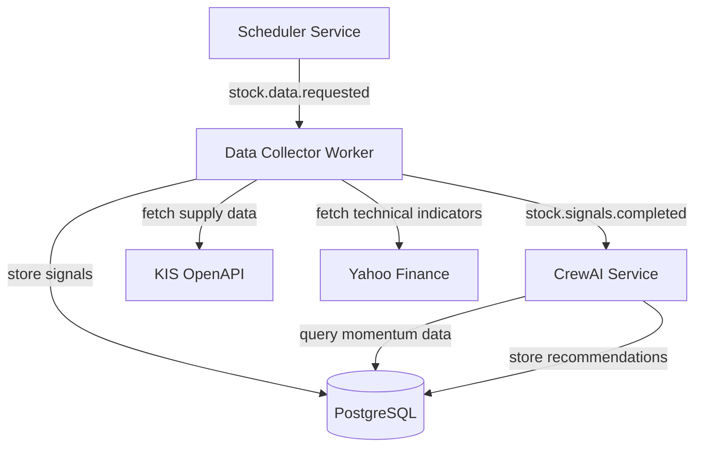
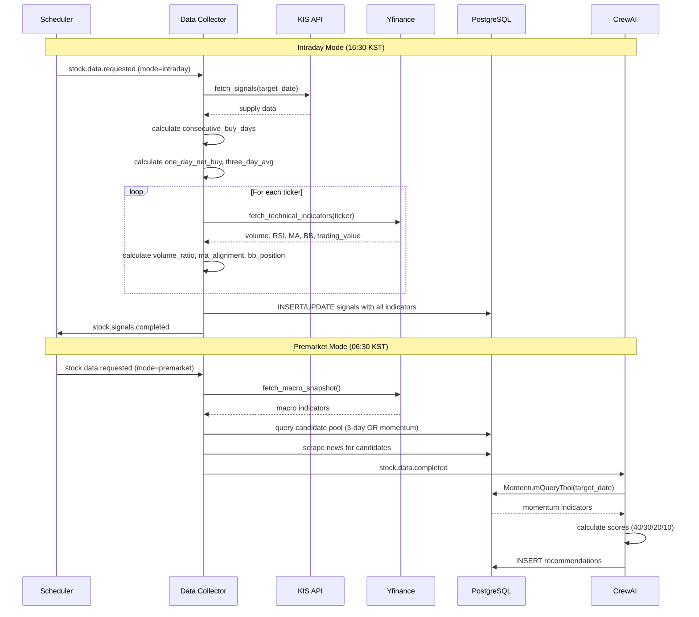
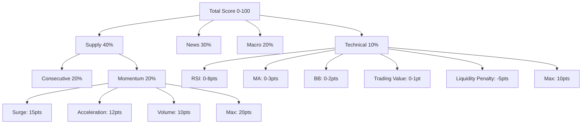
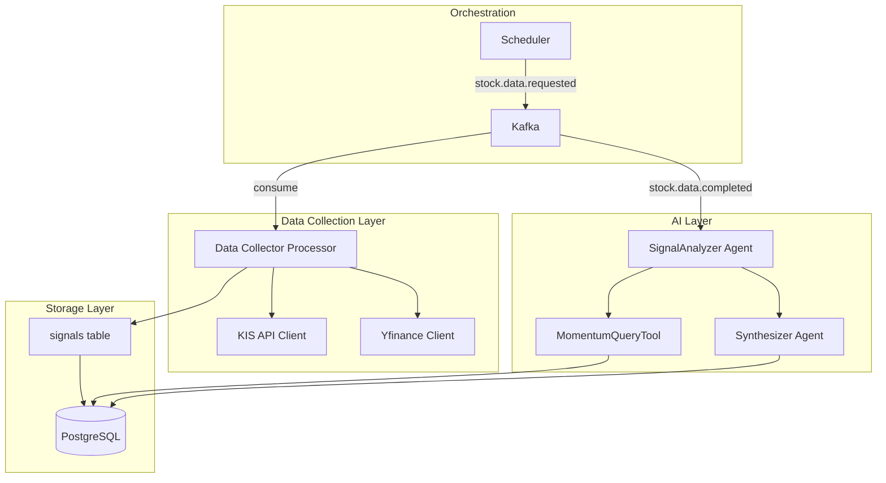

# Design Document: Momentum Signals

## Overview

본 설계는 stock-signal 시스템에 모멘텀 기반 신호 수집 및 평가 기능을 추가한다. 현재 시스템은 "기관·외국인 3일 연속 매수" 단일 조건으로 종목을 선정하는데, 이는 후행 지표로서 고점 근처 진입 위험이 있고 급등주나 갑작스런 호재를 추격하지 못하는 한계가 있다.

본 기능은 다음 모멘텀 지표를 추가하여 AI 추천의 정확도와 적시성을 향상시킨다:
- **급등 모멘텀**: 1일 순매수 100억 이상 (기관+외국인 합산)
- **가속 패턴**: 당일 순매수가 3일 평균의 2배 이상
- **거래량 급증**: 당일 거래량이 20일 평균의 3배 이상
- **기술적 지표**: RSI, 이동평균선 배열, 볼린저밴드 위치, 거래대금

### Design Goals

1. **적시성 향상**: 급등 모멘텀 감지로 고점 진입 전 포착
2. **정확도 향상**: 기술적 지표로 과매수/과매도 구간 식별
3. **하위 호환성**: 기존 3일 연속 매수 로직 유지
4. **확장성**: 새로운 지표 추가 용이한 구조
5. **성능**: 200종목 기준 5분 이내 수집 완료

## Architecture

### System Context



### Component Interaction Flow

**Intraday Mode (16:30 KST)**:
1. Scheduler publishes `stock.data.requested` with `mode=intraday`
2. Data Collector fetches supply data from KIS API
3. Data Collector calculates `one_day_net_buy` and `three_day_avg_net_buy`
4. Data Collector fetches technical indicators from yfinance for each ticker
5. Data Collector stores all data to `signals` table
6. Data Collector publishes `stock.signals.completed`

**Premarket Mode (06:30 KST)**:
1. Scheduler publishes `stock.data.requested` with `mode=premarket`
2. Data Collector fetches macro indicators from yfinance
3. Data Collector queries candidate pool (3-day consecutive OR momentum signals)
4. Data Collector scrapes news for candidates
5. Data Collector publishes `stock.data.completed`
6. CrewAI receives event and starts recommendation workflow
7. SignalAnalyzer uses MomentumQueryTool to fetch momentum data
8. SignalAnalyzer applies new scoring system (40/30/20/10)

## Components and Interfaces

### 1. Database Schema Extension

**Table**: `signals`

**New Columns**:
```sql
-- Momentum indicators
one_day_net_buy BIGINT NULL,           -- agency_net_buy + foreign_net_buy
three_day_avg_net_buy BIGINT NULL,     -- 3-day moving average of one_day_net_buy

-- Volume indicators
volume_ratio NUMERIC(6,2) NULL,        -- current_volume / 20day_avg_volume

-- Technical indicators
rsi NUMERIC(5,2) NULL,                 -- 14-period RSI (0-100)
ma_alignment VARCHAR(20) NULL,         -- 'bullish' | 'bearish' | 'neutral'
bollinger_position NUMERIC(4,3) NULL,  -- (price - lower) / (upper - lower)
trading_value BIGINT NULL              -- trading value in KRW
```

**Migration Strategy**:
- Alembic migration adds columns with `nullable=True`
- Existing rows default to `NULL`
- No data loss during migration
- Backward compatible: NULL values treated as zero score

### 2. Yfinance Client Extension

**Module**: `workers/data_collector/clients/yfinance_client.py`

**New Function**:
```python
@dataclass(slots=True)
class TechnicalIndicators:
    ticker: str
    date: date
    volume: Optional[int] = None
    volume_20d_avg: Optional[float] = None
    volume_ratio: Optional[float] = None
    rsi: Optional[float] = None
    ma_5d: Optional[float] = None
    ma_20d: Optional[float] = None
    ma_60d: Optional[float] = None
    ma_alignment: Optional[str] = None
    bb_upper: Optional[float] = None
    bb_lower: Optional[float] = None
    bb_position: Optional[float] = None
    trading_value: Optional[int] = None

async def fetch_technical_indicators(
    ticker: str,
    target_date: date
) -> TechnicalIndicators:
    """
    Fetch technical indicators for a single ticker.
    
    Uses yfinance to fetch:
    - 60 days of historical data (for MA60 and volume average)
    - Calculates RSI (14-period)
    - Calculates MA (5, 20, 60 day)
    - Calculates Bollinger Bands (20-period, 2 std dev)
    - Determines MA alignment
    
    Returns TechnicalIndicators with NULL for failed calculations.
    """
```

**Implementation Details**:
- Fetch 60 days of historical data in single API call
- Use pandas for efficient calculation
- RSI calculation: Standard Wilder's smoothing method
- Bollinger Bands: 20-period SMA ± 2 standard deviations
- MA Alignment logic:
  - `bullish`: MA5 > MA20 > MA60
  - `bearish`: MA5 < MA20 < MA60
  - `neutral`: otherwise
- Error handling: Return NULL for individual indicator failures
- Async wrapper: Use `asyncio.to_thread` for sync yfinance calls

### 3. Data Collector Processor

**Module**: `workers/data_collector/processor.py`

**Modified Function**: `process_intraday`

```python
async def process_intraday(
    pool: asyncpg.Pool, target_date: date
) -> dict[str, int | bool | str]:
    """
    Enhanced intraday processing with technical indicators.
    
    Steps:
    1. Fetch supply data from KIS API (existing)
    2. Calculate consecutive_buy_days (existing)
    3. Calculate one_day_net_buy and three_day_avg_net_buy (new)
    4. Fetch technical indicators from yfinance (new)
    5. Store all data to signals table (modified)
    6. Fill holding names (existing)
    
    Returns:
        {
            "mode": "intraday",
            "signals_count": int,
            "technical_indicators_count": int,
            "technical_indicators_failed": int,
            "target_date": str
        }
    """
```

**New Helper Functions**:
```python
async def _calculate_momentum_indicators(
    conn: asyncpg.Connection,
    ticker: str,
    target_date: date,
    agency_net_buy: int,
    foreign_net_buy: int
) -> tuple[int, Optional[int]]:
    """
    Calculate one_day_net_buy and three_day_avg_net_buy.
    
    Returns: (one_day_net_buy, three_day_avg_net_buy)
    """

async def _fetch_and_store_technical_indicators(
    pool: asyncpg.Pool,
    tickers: list[str],
    target_date: date
) -> tuple[int, int]:
    """
    Fetch technical indicators for all tickers and update signals table.
    
    Returns: (success_count, failure_count)
    """
```

### 4. CrewAI Tool: MomentumQueryTool

**Module**: `crewai/crews/stock_recommendation/tools.py`

**New Tool**:
```python
class MomentumQueryInput(BaseModel):
    target_date: str = Field(description="조회 기준일 (YYYY-MM-DD)")
    tickers: Optional[list[str]] = Field(
        default=None,
        description="지정 시 해당 ticker만 반환. 미지정 시 모든 ticker."
    )

class MomentumQueryTool(VibeBaseTool):
    name: str = "momentum_query"
    description: str = (
        "특정 거래일의 모멘텀 지표를 조회한다. "
        "급등 모멘텀, 가속 패턴, 거래량 급증, RSI, MA 배열, "
        "볼린저밴드 위치, 거래대금을 반환한다."
    )
    args_schema: type[BaseModel] = MomentumQueryInput

    def _run(
        self,
        target_date: str,
        tickers: Optional[list[str]] = None
    ) -> str:
        """
        Query momentum indicators from signals table.
        
        Returns JSON:
        {
            "count": int,
            "items": [
                {
                    "ticker": str,
                    "one_day_net_buy": int | null,
                    "three_day_avg_net_buy": int | null,
                    "volume_ratio": float | null,
                    "rsi": float | null,
                    "ma_alignment": str | null,
                    "bollinger_position": float | null,
                    "trading_value": int | null
                }
            ]
        }
        """
```

### 5. CrewAI Agent Modifications

**Module**: `crewai/crews/stock_recommendation/agents.py`

**Modified Agent**: `SignalAnalyzerAgent`

```python
class SignalAnalyzerAgent(BaseAgent):
    role = "수급 패턴 분석가"
    goal = (
        "기관·외국인 수급 흐름과 모멘텀 지표를 분석하여 "
        "시그널 강한 후보를 도출한다. "
        "3일 연속 매수 OR 급등 모멘텀 OR 거래량 급증 조건을 만족하는 종목을 포함한다."
    )
    backstory = (
        "10년간 한국 주식시장의 외국인·기관 수급 패턴과 기술적 지표를 추적해온 애널리스트. "
        "단기 노이즈를 걸러내고 의미있는 매집/이탈 신호만 골라낸다. "
        "**모든 분석 출력은 한국어로 작성한다.**"
    )
    tools = (SignalQueryTool(), MomentumQueryTool(), HoldingsQueryTool())
```

### 6. CrewAI Task Modifications

**Module**: `crewai/crews/stock_recommendation/tasks.py`

**Modified Task**: `SignalAnalysisTask`

Key changes:
- Add momentum query step after signal query
- Expand candidate pool logic:
  - Include tickers with `consecutive_buy_days >= 3` (existing)
  - Include tickers with `one_day_net_buy >= 10_000_000_000` (new)
  - Include tickers with `volume_ratio >= 3.0 AND one_day_net_buy > 0` (new)
- Calculate momentum score (0-20 points):
  - Surge momentum: 15 points
  - Acceleration pattern: 12 points
  - Volume surge: 10 points
  - Maximum: 20 points (take highest)

**Modified Task**: `SynthesisTask`

Key changes:
- Update scoring weights: supply 40%, news 30%, macro 20%, technical 10%
- Split supply score: consecutive (20%) + momentum (20%)
- Add technical score calculation:
  - RSI: 0-8 points (30-70: 5pts, <30: 8pts, >70: 2pts)
  - MA alignment: 0-3 points (bullish: 3pts, neutral: 1pt, bearish: 0pts)
  - Bollinger position: 0-2 points (0.3-0.7: 1pt, <0.2: 2pts, >0.8: 0pts)
  - Trading value: 0-1 point (>=100억: 1pt)
  - Liquidity penalty: -5 points if trading_value < 50억

## Data Models

### SignalSnapshot (Extended)

```python
class SignalSnapshot(BaseModel):
    """일별 종목 수급 스냅샷 — signals 테이블 1행에 대응."""
    
    # Existing fields
    date: date
    ticker: str = Field(min_length=6, max_length=10)
    agency_buy: int
    agency_sell: int
    agency_net_buy: int
    foreign_buy: int
    foreign_sell: int
    foreign_net_buy: int
    consecutive_buy_days: int = Field(default=0)
    collected_at: datetime = Field(default_factory=datetime.utcnow)
    
    # New momentum fields
    one_day_net_buy: Optional[int] = None
    three_day_avg_net_buy: Optional[int] = None
    
    # New volume fields
    volume_ratio: Optional[float] = None
    
    # New technical fields
    rsi: Optional[float] = None
    ma_alignment: Optional[str] = None
    bollinger_position: Optional[float] = None
    trading_value: Optional[int] = None
```

### TechnicalIndicators

```python
@dataclass(slots=True)
class TechnicalIndicators:
    """기술적 지표 스냅샷 — yfinance에서 계산."""
    
    ticker: str
    date: date
    
    # Volume indicators
    volume: Optional[int] = None
    volume_20d_avg: Optional[float] = None
    volume_ratio: Optional[float] = None
    
    # RSI
    rsi: Optional[float] = None
    
    # Moving averages
    ma_5d: Optional[float] = None
    ma_20d: Optional[float] = None
    ma_60d: Optional[float] = None
    ma_alignment: Optional[str] = None  # 'bullish' | 'bearish' | 'neutral'
    
    # Bollinger Bands
    bb_upper: Optional[float] = None
    bb_lower: Optional[float] = None
    bb_position: Optional[float] = None
    
    # Trading value
    trading_value: Optional[int] = None
```

### MomentumSignal (Derived)

```python
@dataclass(slots=True)
class MomentumSignal:
    """모멘텀 신호 분류 결과."""
    
    ticker: str
    has_surge_momentum: bool  # one_day_net_buy >= 10B
    has_acceleration: bool    # one_day_net_buy >= 2 * three_day_avg
    has_volume_surge: bool    # volume_ratio >= 3.0
    momentum_score: int       # 0-20 points
```


## Correctness Properties

*A property is a characteristic or behavior that should hold true across all valid executions of a system—essentially, a formal statement about what the system should do. Properties serve as the bridge between human-readable specifications and machine-verifiable correctness guarantees.*

### Property Reflection

After analyzing all acceptance criteria, I identified the following redundancies:

**Scoring Properties Consolidation**:
- Properties 5.3, 5.4, 5.5 (RSI scoring) can be combined into one comprehensive RSI scoring property
- Properties 6.5, 6.6, 6.7 (MA alignment scoring) can be combined into one MA alignment scoring property
- Properties 7.4, 7.5, 7.6 (Bollinger position scoring) can be combined into one Bollinger scoring property
- Properties 2.4, 3.3, 4.3 (momentum component scoring) are already covered by Property 10.3 (comprehensive momentum scoring)

**Candidate Pool Properties Consolidation**:
- Properties 11.1, 11.2, 11.3 (candidate inclusion rules) can be combined into one comprehensive candidate pool property

**MA Alignment Classification Consolidation**:
- Properties 6.2, 6.3, 6.4 (MA alignment classification) can be combined into one comprehensive classification property

After reflection, the following properties provide unique validation value:

### Property 1: One-day net buy calculation

*For any* signal with agency_net_buy and foreign_net_buy values, the one_day_net_buy field should equal the sum of agency_net_buy and foreign_net_buy.

**Validates: Requirements 2.2**

### Property 2: Three-day average net buy calculation

*For any* ticker with at least 3 days of historical signal data, the three_day_avg_net_buy should equal the average of the most recent 3 one_day_net_buy values.

**Validates: Requirements 3.1**

### Property 3: Volume ratio calculation

*For any* ticker with current volume and 20-day average volume data, the volume_ratio should equal current_volume divided by 20-day average volume, and when 20-day average is zero or unavailable, volume_ratio should be NULL.

**Validates: Requirements 4.2, 4.4**

### Property 4: Bollinger position calculation

*For any* ticker with Bollinger Band data where upper_band does not equal lower_band, the bollinger_position should equal (current_price - lower_band) / (upper_band - lower_band), and when upper_band equals lower_band, bollinger_position should be NULL.

**Validates: Requirements 7.2, 7.7**

### Property 5: RSI precision constraint

*For any* stored RSI value that is not NULL, the value should have at most 2 decimal places and be in the range [0, 100].

**Validates: Requirements 5.2**

### Property 6: Bollinger position precision and range constraint

*For any* stored bollinger_position value that is not NULL, the value should have at most 3 decimal places and be in the range [0, 1].

**Validates: Requirements 7.3**

### Property 7: MA alignment classification

*For any* ticker with 5-day, 20-day, and 60-day moving average data, the ma_alignment should be "bullish" when MA5 > MA20 > MA60, "bearish" when MA5 < MA20 < MA60, and "neutral" otherwise, and when moving average calculation fails, ma_alignment should be NULL.

**Validates: Requirements 6.2, 6.3, 6.4, 6.8**

### Property 8: Surge momentum detection

*For any* signal where one_day_net_buy is greater than or equal to 10,000,000,000, the signal should be marked as having surge momentum.

**Validates: Requirements 2.1**

### Property 9: Acceleration pattern detection

*For any* signal where one_day_net_buy is greater than or equal to 2 times three_day_avg_net_buy AND three_day_avg_net_buy is positive, the signal should be marked as having acceleration pattern, and when three_day_avg_net_buy is less than or equal to zero, the signal should not have acceleration pattern.

**Validates: Requirements 3.2, 3.4**

### Property 10: Candidate pool expansion

*For any* ticker on a given date, it should be included in the candidate pool if ANY of the following conditions are met: (1) consecutive_buy_days >= 3, (2) one_day_net_buy >= 10,000,000,000, or (3) volume_ratio >= 3.0 AND one_day_net_buy > 0, and holdings tickers should be excluded from new_candidates.

**Validates: Requirements 2.3, 11.1, 11.2, 11.3, 11.4**

### Property 11: RSI scoring

*For any* signal with a non-NULL RSI value, the RSI technical score component should be 8 points when RSI < 30, 5 points when 30 <= RSI <= 70, and 2 points when RSI > 70.

**Validates: Requirements 5.3, 5.4, 5.5**

### Property 12: MA alignment scoring

*For any* signal with a non-NULL ma_alignment value, the MA technical score component should be 3 points when ma_alignment is "bullish", 1 point when "neutral", and 0 points when "bearish".

**Validates: Requirements 6.5, 6.6, 6.7**

### Property 13: Bollinger position scoring

*For any* signal with a non-NULL bollinger_position value, the Bollinger technical score component should be 2 points when bollinger_position < 0.2, 1 point when 0.3 <= bollinger_position <= 0.7, and 0 points when bollinger_position > 0.8.

**Validates: Requirements 7.4, 7.5, 7.6**

### Property 14: Trading value scoring and penalty

*For any* signal with a non-NULL trading_value, the trading value technical score component should be 1 point when trading_value >= 10,000,000,000, and the total score should be reduced by 5 points when trading_value < 5,000,000,000.

**Validates: Requirements 8.3, 8.4**

### Property 15: Momentum score calculation

*For any* signal, the momentum score should be calculated as the maximum of: surge momentum (15 points if present), acceleration pattern (12 points if present), and volume surge (10 points if volume_ratio >= 3.0), with a maximum total of 20 points.

**Validates: Requirements 10.3**

### Property 16: Technical score calculation

*For any* signal, the technical score should be the sum of RSI score (0-8 points), MA alignment score (0-3 points), Bollinger position score (0-2 points), and trading value score (0-1 point), minus liquidity penalty (5 points if trading_value < 5B), with a maximum of 10 points.

**Validates: Requirements 10.4**

### Property 17: Total score calculation and normalization

*For any* recommendation, the total score should be calculated as a weighted sum of supply (40%), news (30%), macro (20%), and technical (10%) components, where the supply component is split into consecutive_buy_days (20%) and momentum (20%), all component scores are normalized to fit their allocated percentage ranges, and the final score is rounded to an integer in the range [0, 100].

**Validates: Requirements 10.1, 10.2, 10.5, 10.6**

### Property 18: NULL momentum indicator handling

*For any* signal where momentum indicator columns contain NULL values, the Signal_Analyzer should assign zero points for those indicators without failing, and when all momentum indicators are NULL, the system should produce recommendations using the legacy scoring system.

**Validates: Requirements 12.3, 12.5**

### Property 19: Consecutive buy days backward compatibility

*For any* ticker, the consecutive_buy_days calculation should continue to use the existing algorithm where a day is counted as a "buy day" if agency_net_buy > 0 OR foreign_net_buy > 0.

**Validates: Requirements 12.1**

### Property 20: MomentumQueryTool output completeness

*For any* MomentumQueryTool invocation, the returned JSON should contain all required fields (one_day_net_buy, three_day_avg_net_buy, volume_ratio, rsi, ma_alignment, bollinger_position, trading_value) for each ticker, with NULL values explicitly shown when data is unavailable.

**Validates: Requirements 13.2, 13.5**

### Property 21: MomentumQueryTool JSON format

*For any* MomentumQueryTool invocation, the output should be valid JSON conforming to the schema: {"count": int, "items": [{"ticker": str, ...}]}.

**Validates: Requirements 13.3**

### Property 22: Technical indicator fetch failure isolation

*For any* batch of tickers being processed, if technical indicator fetching fails for one ticker, all technical indicators for that ticker should be set to NULL, and the remaining tickers should continue to be processed successfully.

**Validates: Requirements 9.4, 14.2**

### Property 23: Invalid technical indicator value handling

*For any* calculated technical indicator value, if the value is invalid (negative RSI, bollinger_position outside [0, 1] range), the system should set that value to NULL.

**Validates: Requirements 14.3**

## Error Handling

### Data Collection Errors

**Yfinance API Failures**:
- **Strategy**: Graceful degradation per ticker
- **Behavior**: Set all technical indicators to NULL for failed ticker
- **Logging**: Warning with ticker symbol and error message
- **Impact**: Other tickers continue processing

**KIS API Failures**:
- **Strategy**: Retry with exponential backoff (existing)
- **Behavior**: Publish to DLQ after MAX_RETRIES
- **Logging**: Error with retry count
- **Impact**: Entire intraday collection fails (existing behavior)

**Calculation Errors**:
- **Invalid RSI**: Set to NULL if < 0 or > 100
- **Invalid Bollinger Position**: Set to NULL if < 0 or > 1
- **Division by Zero**: Set volume_ratio to NULL if 20-day avg is 0
- **Insufficient Data**: Set indicator to NULL if < required periods

### Database Errors

**Migration Failures**:
- **Strategy**: Alembic transaction rollback
- **Behavior**: No partial schema changes
- **Recovery**: Manual intervention required

**Insert/Update Failures**:
- **Strategy**: Transaction rollback per ticker batch
- **Behavior**: Log error and continue with next batch
- **Impact**: Partial data collection possible

### CrewAI Tool Errors

**MomentumQueryTool Failures**:
- **Invalid Date Format**: Return error JSON with message
- **Database Connection**: Return error JSON, retry handled by CrewAI
- **Empty Results**: Return valid JSON with count=0

**Scoring Calculation Errors**:
- **NULL Handling**: Treat NULL as 0 points
- **Out of Range**: Clamp to valid range [0, 100]
- **Division by Zero**: Use default weights

## Testing Strategy

### Dual Testing Approach

본 기능은 **단위 테스트**와 **속성 기반 테스트(Property-Based Testing)**를 모두 사용하여 포괄적인 검증을 수행한다.

**단위 테스트 (Unit Tests)**:
- 특정 예제와 엣지 케이스 검증
- 통합 지점 검증
- 에러 조건 검증
- 예시:
  - RSI 계산이 정확한지 알려진 데이터셋으로 검증
  - 볼린저밴드 상단=하단일 때 NULL 처리 검증
  - 20일 평균 거래량이 0일 때 volume_ratio NULL 검증
  - Yfinance API 실패 시 NULL 설정 검증

**속성 기반 테스트 (Property-Based Tests)**:
- 범용 속성을 모든 입력에 대해 검증
- 무작위 입력 생성으로 포괄적 커버리지
- 최소 100회 반복 실행
- 각 테스트는 설계 문서의 속성을 참조하는 태그 포함
- 예시:
  - Property 1: 무작위 agency_net_buy, foreign_net_buy 생성 → one_day_net_buy 검증
  - Property 7: 무작위 MA 값 생성 → ma_alignment 분류 검증
  - Property 17: 무작위 컴포넌트 점수 생성 → 총점 계산 및 범위 검증

### Property-Based Testing Configuration

**Library Selection**:
- Python: `hypothesis` (industry standard for Python PBT)
- 설치: `pip install hypothesis`

**Test Configuration**:
```python
from hypothesis import given, settings
import hypothesis.strategies as st

@settings(max_examples=100)  # Minimum 100 iterations
@given(
    agency_net_buy=st.integers(min_value=-1000000000000, max_value=1000000000000),
    foreign_net_buy=st.integers(min_value=-1000000000000, max_value=1000000000000)
)
def test_property_1_one_day_net_buy_calculation(agency_net_buy, foreign_net_buy):
    """
    Feature: momentum-signals, Property 1: For any signal with agency_net_buy 
    and foreign_net_buy values, the one_day_net_buy field should equal the sum 
    of agency_net_buy and foreign_net_buy.
    """
    # Test implementation
    pass
```

**Test Organization**:
- 파일: `tests/unit/test_momentum_signals_properties.py`
- 각 속성마다 하나의 테스트 함수
- 태그 형식: `Feature: momentum-signals, Property {number}: {property_text}`

### Unit Test Focus Areas

**Calculation Functions**:
- `_calculate_momentum_indicators()`: 3일 평균 계산
- `_calculate_rsi()`: RSI 계산 정확도
- `_calculate_bollinger_bands()`: 볼린저밴드 계산
- `_calculate_ma_alignment()`: MA 배열 분류

**Edge Cases**:
- 데이터 부족 (< 60일): NULL 반환
- 0으로 나누기: NULL 반환
- 유효하지 않은 값: NULL 반환
- API 실패: NULL 반환 및 로깅

**Integration Points**:
- `process_intraday()`: 전체 플로우 통합
- `MomentumQueryTool._run()`: 쿼리 결과 형식
- `SignalAnalyzerAgent`: 점수 계산 통합

**Error Conditions**:
- Yfinance API timeout
- Database connection failure
- Invalid ticker symbols
- Malformed data

### Test Data Generators

**Hypothesis Strategies**:
```python
# Signal data generator
@st.composite
def signal_data(draw):
    return {
        'ticker': draw(st.text(min_size=6, max_size=10, alphabet=st.characters(whitelist_categories=('Lu', 'Nd')))),
        'agency_net_buy': draw(st.integers(min_value=-1000000000000, max_value=1000000000000)),
        'foreign_net_buy': draw(st.integers(min_value=-1000000000000, max_value=1000000000000)),
        'volume': draw(st.integers(min_value=0, max_value=1000000000)),
        'close_price': draw(st.floats(min_value=1.0, max_value=1000000.0))
    }

# RSI value generator
rsi_values = st.floats(min_value=0.0, max_value=100.0)

# MA alignment generator
ma_alignment_values = st.sampled_from(['bullish', 'bearish', 'neutral', None])

# Bollinger position generator
bollinger_position_values = st.one_of(
    st.none(),
    st.floats(min_value=0.0, max_value=1.0)
)
```

### Performance Testing

**Load Test Scenarios**:
- 200 tickers × 60 days historical data
- Target: < 5 minutes total collection time
- Yfinance rate limiting: 2000 requests/hour
- Parallel processing: asyncio.gather with semaphore

**Metrics**:
- Average fetch time per ticker
- Success rate
- Failure rate by error type
- Database insert throughput

### Integration Testing

**End-to-End Scenarios**:
1. Intraday collection → signals table updated with momentum indicators
2. Premarket collection → CrewAI receives momentum data
3. SignalAnalyzer → MomentumQueryTool → scoring calculation
4. Recommendation generation with new scoring system

**Test Environment**:
- Docker Compose test stack
- Mocked Yfinance responses for deterministic tests
- Test database with sample data

## Implementation Phases

### Phase 1: Database Schema (Week 1)

**Tasks**:
1. Create Alembic migration for 7 new columns
2. Test migration on staging database
3. Verify backward compatibility with NULL values
4. Update `SignalSnapshot` Pydantic model

**Deliverables**:
- Migration file: `backend/migrations/versions/YYYYMMDD_0001_add_momentum_indicators.py`
- Updated schema: `shared/schemas/signals.py`

### Phase 2: Yfinance Client Extension (Week 1-2)

**Tasks**:
1. Implement `TechnicalIndicators` dataclass
2. Implement `fetch_technical_indicators()` function
3. Add RSI calculation using pandas
4. Add MA calculation (5, 20, 60 day)
5. Add Bollinger Bands calculation
6. Add MA alignment classification logic
7. Add error handling and NULL fallbacks
8. Write unit tests for calculations
9. Write property-based tests for calculations

**Deliverables**:
- Updated: `workers/data_collector/clients/yfinance_client.py`
- Tests: `tests/unit/test_yfinance_technical_indicators.py`

### Phase 3: Data Collector Integration (Week 2)

**Tasks**:
1. Modify `process_intraday()` to call yfinance for technical indicators
2. Implement `_calculate_momentum_indicators()` helper
3. Implement `_fetch_and_store_technical_indicators()` helper
4. Update signals table INSERT/UPDATE to include new columns
5. Add error handling and logging
6. Update return payload with collection status
7. Write integration tests

**Deliverables**:
- Updated: `workers/data_collector/processor.py`
- Tests: `tests/integration/test_data_collector_momentum.py`

### Phase 4: CrewAI Tool (Week 2-3)

**Tasks**:
1. Implement `MomentumQueryInput` schema
2. Implement `MomentumQueryTool` class
3. Add SQL query for momentum indicators
4. Add JSON serialization
5. Write unit tests for tool
6. Write property-based tests for output format

**Deliverables**:
- Updated: `crewai/crews/stock_recommendation/tools.py`
- Tests: `tests/unit/test_momentum_query_tool.py`

### Phase 5: CrewAI Agent & Task Updates (Week 3)

**Tasks**:
1. Update `SignalAnalyzerAgent` with MomentumQueryTool
2. Update `SignalAnalysisTask` description with momentum logic
3. Update candidate pool expansion logic
4. Update `SynthesisTask` with new scoring system
5. Implement momentum score calculation (0-20 points)
6. Implement technical score calculation (0-10 points)
7. Update score normalization and weighting
8. Write unit tests for scoring logic
9. Write property-based tests for scoring properties

**Deliverables**:
- Updated: `crewai/crews/stock_recommendation/agents.py`
- Updated: `crewai/crews/stock_recommendation/tasks.py`
- Tests: `tests/unit/test_signal_analyzer_scoring.py`

### Phase 6: Integration & Testing (Week 3-4)

**Tasks**:
1. Run end-to-end tests on staging
2. Verify backward compatibility with existing tests
3. Performance testing with 200 tickers
4. Load testing for 5-minute target
5. Fix bugs and optimize
6. Update documentation

**Deliverables**:
- All tests passing
- Performance benchmarks documented
- Updated RUNBOOK.md

### Phase 7: Deployment (Week 4)

**Tasks**:
1. Deploy database migration to production
2. Deploy updated services
3. Monitor logs for errors
4. Verify data collection
5. Verify recommendation generation

**Deliverables**:
- Production deployment complete
- Monitoring dashboards updated
- Incident response plan documented

## Diagrams

### Data Flow Diagram



### Scoring System Diagram



### Component Architecture



## Dependencies

### New Python Packages

**workers/data_collector/requirements.txt**:
```
# Existing dependencies remain
yfinance>=0.2.28  # Already present, ensure version supports technical indicators
pandas>=2.0.0     # Required for efficient calculations
numpy>=1.24.0     # Required for RSI and statistical calculations
```

**tests/requirements.txt**:
```
# Existing dependencies remain
hypothesis>=6.82.0  # Property-based testing framework
```

### External APIs

**Yfinance (Yahoo Finance)**:
- Rate Limit: 2000 requests/hour
- Data: Historical OHLCV data
- Cost: Free
- Reliability: Best effort, no SLA

**KIS OpenAPI**:
- Existing dependency
- No additional calls required

### Database

**PostgreSQL**:
- Version: 14+ (existing)
- New columns: 7 (all nullable)
- Storage impact: ~56 bytes per signal row
- Index impact: None (no new indexes required)

## Security Considerations

### Data Privacy

- No PII in momentum indicators
- All data is market data (public)
- No user-specific data in signals table

### API Security

- Yfinance: No authentication required (public API)
- KIS API: Existing OAuth2 flow unchanged
- Rate limiting: Respect yfinance rate limits

### Database Security

- Migration uses existing connection pool
- No new permissions required
- Backward compatible schema changes

## Performance Considerations

### Data Collection Performance

**Target**: 200 tickers in < 5 minutes

**Optimization Strategies**:
1. Parallel fetching with `asyncio.gather`
2. Semaphore to limit concurrent requests (respect rate limits)
3. Batch database updates (transaction per 10 tickers)
4. Cache 60-day historical data per ticker (single API call)

**Estimated Times**:
- Yfinance fetch per ticker: ~1-2 seconds
- Calculation per ticker: ~0.1 seconds
- Database update per ticker: ~0.05 seconds
- Total for 200 tickers: ~4-5 minutes (with parallelism)

### Database Performance

**Query Performance**:
- MomentumQueryTool: Uses existing date+ticker index
- No new indexes required
- Query time: < 100ms for 200 tickers

**Storage Impact**:
- 7 new columns × 8 bytes average = 56 bytes per row
- 200 tickers × 365 days = 73,000 rows/year
- Storage increase: ~4 MB/year (negligible)

### CrewAI Performance

**Scoring Calculation**:
- Pure Python calculations
- No external API calls
- Time per ticker: < 10ms
- Total for 5 tickers: < 50ms (negligible)

## Monitoring and Observability

### Metrics

**Data Collection**:
- `momentum.collection.duration_seconds`: Histogram of collection time
- `momentum.collection.success_count`: Counter of successful fetches
- `momentum.collection.failure_count`: Counter of failed fetches
- `momentum.collection.ticker_count`: Gauge of tickers processed

**Scoring**:
- `momentum.scoring.momentum_score`: Histogram of momentum scores
- `momentum.scoring.technical_score`: Histogram of technical scores
- `momentum.scoring.surge_momentum_count`: Counter of surge momentum signals
- `momentum.scoring.acceleration_count`: Counter of acceleration patterns

### Logging

**Structured Logs**:
```python
logger.info(
    "technical_indicators_collected",
    ticker=ticker,
    rsi=rsi,
    ma_alignment=ma_alignment,
    volume_ratio=volume_ratio,
    duration_ms=duration
)

logger.warning(
    "technical_indicator_fetch_failed",
    ticker=ticker,
    error=str(exc),
    error_type=type(exc).__name__
)
```

### Alerts

**Critical**:
- Technical indicator collection failure rate > 50%
- Collection duration > 10 minutes

**Warning**:
- Technical indicator collection failure rate > 20%
- Collection duration > 7 minutes
- Invalid indicator values > 10%

## Rollback Plan

### Database Rollback

**Downgrade Migration**:
```python
def downgrade() -> None:
    op.drop_column("signals", "trading_value")
    op.drop_column("signals", "bollinger_position")
    op.drop_column("signals", "ma_alignment")
    op.drop_column("signals", "rsi")
    op.drop_column("signals", "volume_ratio")
    op.drop_column("signals", "three_day_avg_net_buy")
    op.drop_column("signals", "one_day_net_buy")
```

**Data Loss**: None (columns are nullable, existing data unaffected)

### Service Rollback

**Data Collector**:
- Revert to previous version
- Existing functionality continues to work
- New columns remain NULL (no impact)

**CrewAI**:
- Revert to previous version
- MomentumQueryTool not called
- Scoring reverts to legacy system (50/25/25)
- NULL momentum indicators handled gracefully

### Rollback Triggers

- Collection failure rate > 80% for 1 hour
- Recommendation generation failure rate > 50%
- Database performance degradation > 2x
- Critical bugs in scoring logic

## Future Enhancements

### Additional Technical Indicators

- MACD (Moving Average Convergence Divergence)
- Stochastic Oscillator
- ATR (Average True Range)
- OBV (On-Balance Volume)

### Machine Learning Integration

- Predict momentum continuation probability
- Anomaly detection for unusual patterns
- Sentiment analysis from news text

### Real-time Updates

- Intraday momentum tracking (every hour)
- WebSocket updates to frontend
- Real-time alerts for surge momentum

### Backtesting Framework

- Historical performance analysis
- Strategy optimization
- Risk-adjusted returns calculation
